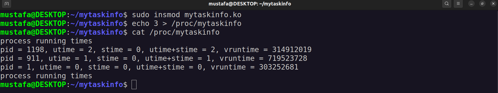

# Task Info Kernel Module

2022 Fall Semester Operating Systems Lecture Homework

## Details

``mytaskinfo`` is a kernel module that creates a file named **mytaskinfo** in ***/proc*** filesystem. It serves as a interface between internal kernel data structures and user.

**mytaskinfo** takes the number of processes and calculates the **utime**, **stime** information of the given number of processes with the largest value ``(utime+stime)`` in seconds and prints this information and the ``se.vruntime`` information calculated by the kernel and used in *CFS*.

> **utime** : is the time the process has been in user mode. In other words, it represent the CPU usage time of the process itself

> **stime** : is the time the process has been in kernel mode. It means that stime represents the time of operations performed by the system for the process.

> **vruntime** : is the weighted time a task has run on the CPU

## Installation

1. type ``make``, generates kernel object
2. type `sudo insmod mytaskinfo.ko`, inserts module to kernel
3. you can check if it is installed by ``sudo lsmod | grep mytaskinfo``

## Usage

For instance, if you want to see 2 processes have the biggest total time

1. ``echo "2" > /proc/mytaskinfo``
2. ``cat /proc/mytaskinfo``

> The only problem is that it prints until it reaches BUFSIZ limit. It should be print until end of the text.
